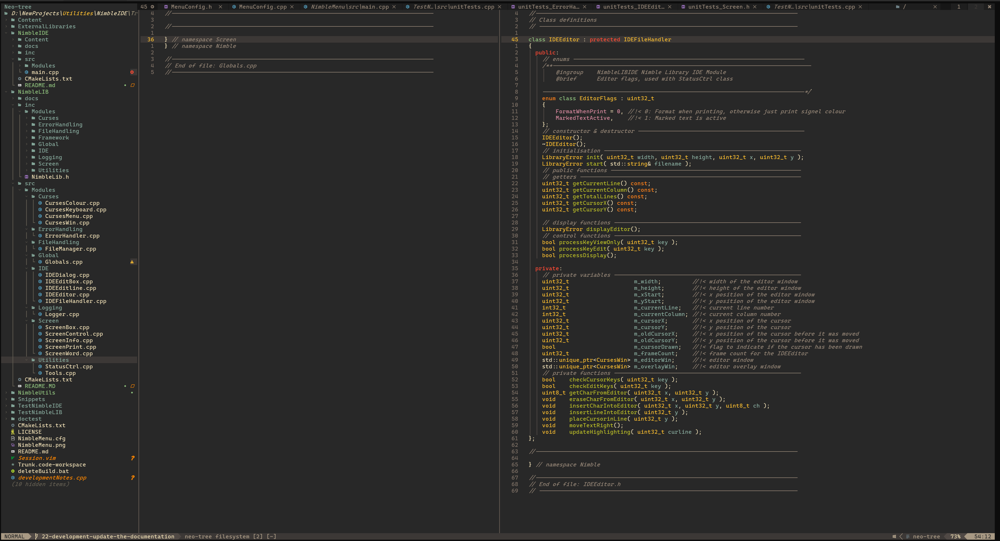

# Nimble Library Console Support Modules

This library has been created for the NimbleIDE

NimbleLIB is the library of modules used by NimbleIDE and TestNimbleIDE. It contains the following modules:

| Module                          | Description                                                       |
| :------------------------------ | :---------------------------------------------------------------- |
| [Screen](#screen)               | Low-level ASCII encoded console screen functionality              |
| [Curses](#curses)               | Various support for the ncurses SDK                               |
| [ErrorHandling](#errorhandling) | ErrorHandling and error numbers reporting failures in the library |
| [IDE](#ide)                     | Editor and editing support for the IDE                            |
| [Global](#global)               | Global information, shared across modules                         |
| [Logger](#logger)               | Logs formated messages to various outputs                         |
| [Utilities](#utilities)         | Functionality shared across the modules                           |
| [Framework](#framework)         | Framework for the supporting CPUs                                 |

#### Screen

This module contains basic support for screen clear, displaying text and moving the cursor.

Basic ASCII extended codes are used to clear, write to and move the cursor on the screen.

#### Curses

The Curses module is used to create a screen buffer and display it on the screen. It is used by the `NimbleIDE` and `TestNimbleIDE` applications.

Curses supports not only the screen display and handling, but also windows and input handling.

#### ErrorHandling

This static class handles all errors that occur in the application. It can be used to log errors to a file or to the screen.

#### IDE

This module contains the core functionality to allow editing and display of information.
Editing is via a IDEEditor class and IDEEditBox class
IDEDialog is the generic dialog class, allowing the display of error messages.

#### Utilities

Functionality that is used by multiple modules is placed in the Utilities module.

#### Global

Defines and data that are used within all the modules are placed in the Global module.

#### Logger

Linked into the ErrorHandling module, this module handles logging to a file.

#### Framework

This module will handle the framework for the hardware.
