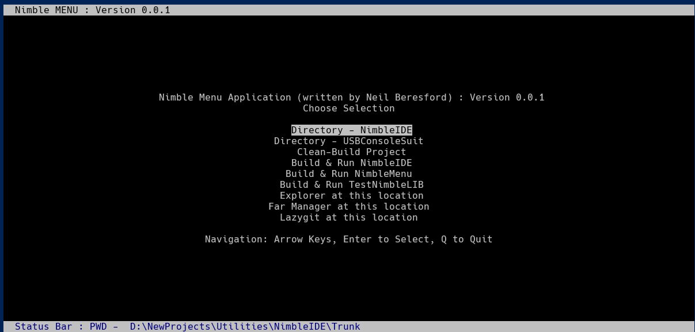

# Nimble IDE Suite

## IMPORTANT NOTE

This is in initial development, the project has only just started.

* develop branch will always have a buildable project.
* development is via issues and created branchs from develop.
* releases will go to the main branch, as and when
 

## Application list

Main Library And Applications

- [NimbleLIB](#nimblelib)
- [NimbleIDE](#nimbleide)
- [TestNimbleIDE](#testnimbleide)
- [TestNimbleLIB](#testnimblelib)

Nimble Utilities
- [NimbeUtils - NimbleMenu](#nimblemenu)

## NimbleLIB

NimbleLIB is the library of modules used by NimbleIDE and TestNimbleIDE. It contains the following modules:

### Screen

This module contains basic support for screen clear, displaying text and moving the cursor.

Basic ASCII extended codes are used to clear, write to and move the cursor on the screen.

### Curses

The Curses module is used to create a screen buffer and display it on the screen. It is used by the `NimbleIDE` and `TestNimbleIDE` applications.

Curses supports not only the screen display and handling, but also windows and input handling.

### ErrorHandling

This static class handles all errors that occur in the application. It can be used to log errors to a file or to the screen.

### Utilities

Functionality that is used by multiple modules is placed in the Utilities module.

#### Global

Defines and data that are used within all the modules are placed in the Global module.

#### Logger

Linked into the ErrorHandling module, this module handles logging to a file.

#### Framework

This module will handle the framework for the hardware.
 

## NimbleIDE

The main IDE, linked with NimbleLIB. It currently tests the development of the NimbleLIB modules.


## TestNimbleIDE

Tests the modules developed in NimbleIDE and NimbleLIB.

## TestNimbleLIB

Complete tests for the NimbleLIB modules.
Currently only tests the Screen and ErrorHandling modules.

## NimbleMenu

##### Found in NimbleUtils directory
This utility allows quick selection of actions from a menu.
Setup to allow for easy integration into other applications.
The menu is a simple list of options, with a title and a prompt.
The options are numbered in a configuration file that is loaded from
the current directory where `NimbleMunu.exe` is ran.
Configuration file is called `NimbleMenu.cfg`
Items are numbered from 0 to 9, and are displayed in the order they are in the file.
Each item has a title and a command to run.
Please note 'cd' commands are supported, 'cd' is stripped and also the '\n' is stripped.
Each command is sperated by either of the following:
* ` & ` - run the command and continue
* ` && ` - runs the next command if no errors are reported by the previous command

The following is a working example of the configuration file


And it is created by the following configuration - called `NimbeMenu.cfg`.

```
// Nimble Menu Items -
Items = 9
1^Directory - NimbleIDE^cd D:\NewProjects\Utilities\NimbleIDE\Trunk
2^Directory - USBConsoleSuit^cd D:\NewProjects\Utilities\USBHIDConsoleSuite\Trunk
3^Clean-Build Project^cd build && rmdir -f . & cmake .. && cmake --build .
4^Build & Run NimbleIDE^ cmake --build build --target NimbleIDE && cd build\NimbleIDE\Debug\ && .\NimbleIDE.exe
5^Build & Run NimbleMenu^ cmake --build build --target NimbleMenu && cd build\NimbleUtils\NimbleMENU\Debug\ && .\NimbleMENU.exe
6^Build & Run TestNimbleLIB^ cmake --build build --target TestNimbleLIB && cd build\TestNimbleLIB\Debug\ && .\TestNimbleLIB.exe && timeout /t 10
7^Explorer at this location^explorer .
8^Far Manager at this location^"c:\Program Files\Far Manager\Far.exe" .
9^Lazygit at this location^lazygit.exe
```


## Pre-requisites

- CMake - for creating and building the projects.
- Visual Studio 2022 - for building the projects.
- Git - for cloning the repository.
 Doxygen - for generating the documentation.
- .Net 7.0 SDK - for building the projects.
- .Net 7.0 Runtime - for running the projects.

### Optional

- Visual Studio Code - for editing the projects.
- NeoVim - for editing the projects. (I use LazyVim)
- LazyGit - for managing the repository.

## Installation

Please follow the instructions below to install the application.

Retrieve the source code from GitHub:

```bash
    git clone https://github.com/MadFly-Team/NimbleIDE.git NimbleIDE
```

## Building the applications

```bash
    cd NimbleIDE
    mkdir build
    cd build
    cmake ..
    cmake --build .
```

## Running the applications

```bash
    cd NimbleIDE
    ./build/NimbleIDE/Debug/NimbleIDE.exe
```

Run the tests:

```bash
    cd NimbleIDE
    ./build/NimbleIDE/TestNimbleIDE/Debug/TestNimbleIDE.exe
```
